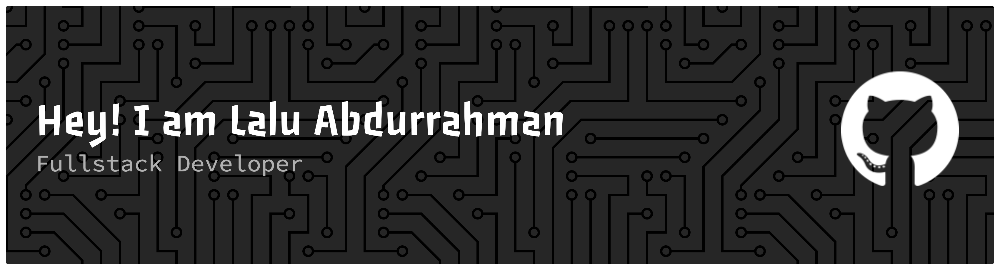

###

###

I am a Web Programmer specializing in backend development and scalable system architecture. I have experience in building applications from initial planning and implementation to deployment, both independently and in collaborative team environments. I am highly committed to writing clean, secure, and efficient code, with a strong focus on system reliability and performance.

###

 

  
  
  
  

###

<h2 align="center">I code with</h2>

###

 

  
  
  
  
  
  
  
  
  
  
  
  
  
  
  
  
  
  
  
  
  
  
  
  
  
  
  
  
  
  
  
  
  

 

 

<picture>
  <source media="(prefers-color-scheme: dark)" srcset="https://raw.githubusercontent.com/lalurahman/lalurahman/output/pacman-contribution-graph-dark.svg">
  <source media="(prefers-color-scheme: light)" srcset="https://raw.githubusercontent.com/lalurahman/lalurahman/output/pacman-contribution-graph.svg">
  
</picture>

###

###
